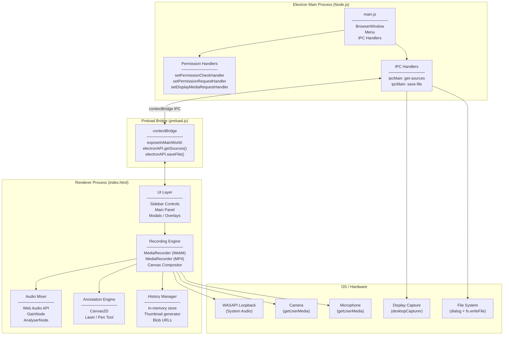
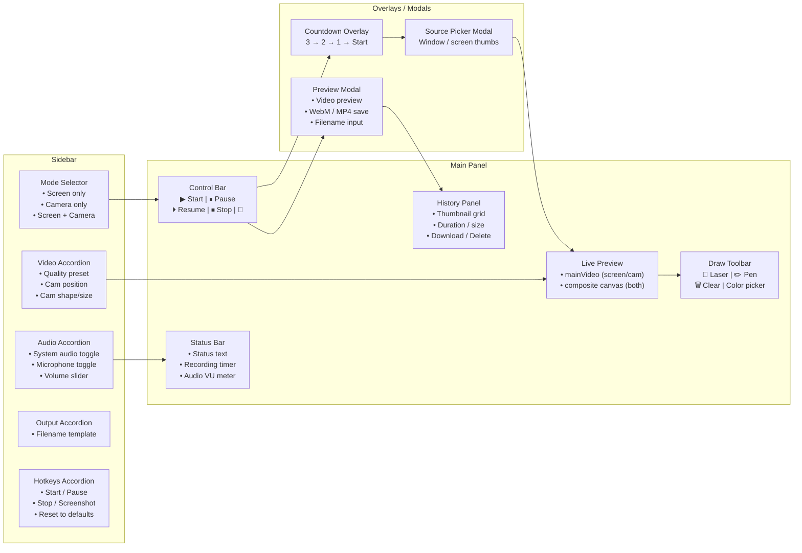
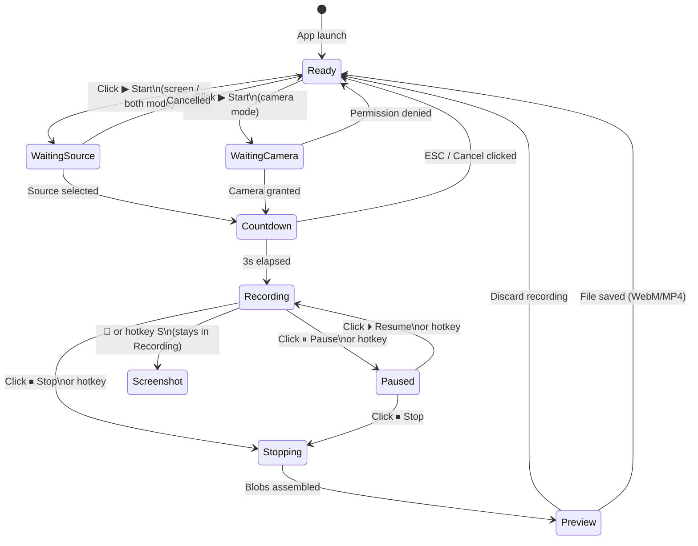
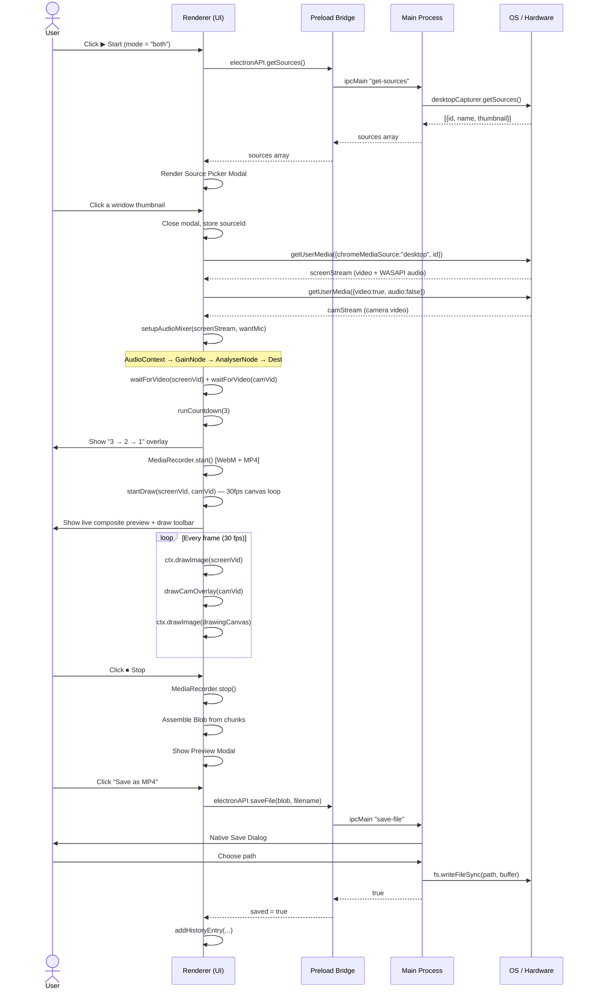
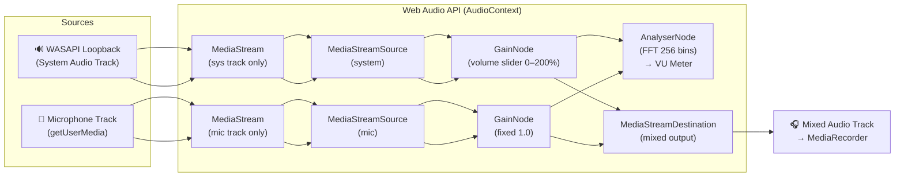
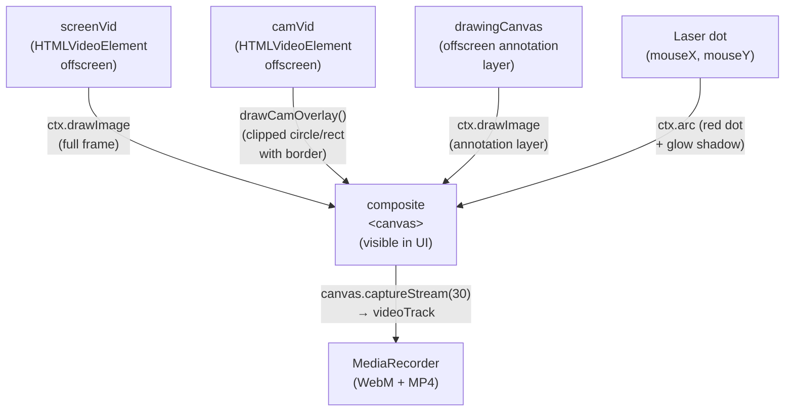
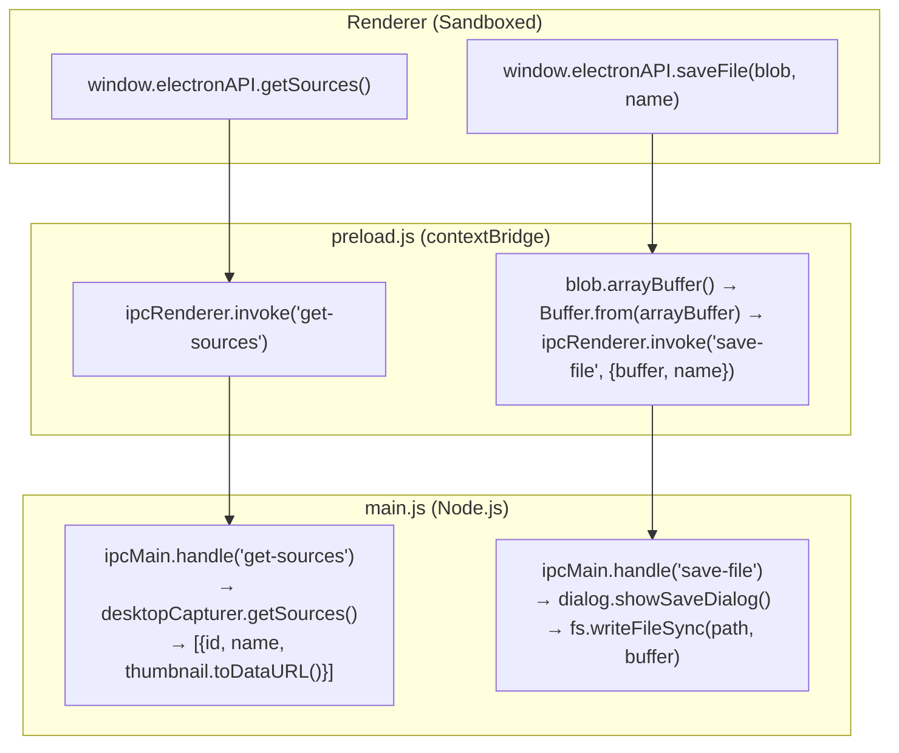

# 🎬 Screen Recorder

> A powerful, privacy-first desktop screen recorder for Windows 10 & 11 — built with Electron. No uploads, no accounts, no limits.

[](https://github.com/arqam66/screen_recoder/releases/tag/v1.2.0)
[](https://github.com/arqam66/screen_recoder/releases)
[](https://www.electronjs.org/)
[](LICENSE)

---

## 📥 Download

| File | Description |
|---|---|
| [**Screen Recorder Setup 1.2.0.exe**](https://github.com/arqam66/screen_recoder/releases/download/v1.2.0/Screen.Recorder.Setup.1.2.0.exe) | Full installer — Start Menu & Desktop shortcuts, uninstaller |
| [**Screen-Recorder-1.2.0-portable.exe**](https://github.com/arqam66/screen_recoder/releases/download/v1.2.0/Screen-Recorder-1.2.0-portable.exe) | Portable — run directly, no installation needed |

**Requirements:** Windows 10 or 11 (64-bit)

---

## ✨ Features

| Feature | Description |
|---|---|
| 🖥️ **Screen Recording** | Record any window, tab, or full screen via native picker |
| 📷 **Camera Recording** | Webcam-only recording with microphone |
| 🎬 **Screen + Camera** | Screen with face-cam overlay (circle or rectangle, 4 positions, adjustable size) |
| 🔊 **System Audio** | Captures device audio via WASAPI loopback — no virtual cable needed |
| 🎤 **Microphone** | Mix mic voice alongside system audio in real time |
| 🎚️ **Audio Mixer** | Web Audio API gain control, real-time VU meter |
| ✏️ **Annotations** | Draw on screen while recording with pen tool |
| 🔴 **Laser Pointer** | Real-time laser pointer rendered into the video |
| 📸 **Screenshot** | Capture PNG snapshots any time during recording |
| ⌨️ **Hotkeys** | Fully customizable keyboard shortcuts |
| 💾 **Local Save** | Save as WebM or MP4 — files never leave your machine |
| 🕘 **History Panel** | In-session recording history with thumbnails, preview, and re-download |
| 🌙 **Dark / Light Theme** | Persisted theme toggle |
| ⏱️ **Countdown Timer** | 3-second countdown before recording starts (cancellable) |
| 📁 **Filename Templates** | `{date}`, `{time}`, `{mode}` tokens in output filename |

---

## 🏗️ Architecture Overview



---

## 🗂️ Project Structure

```
screen_recorder/
├── main.js           # Electron main process — window, IPC, permissions
├── preload.js        # Secure IPC bridge (contextBridge)
├── index.html        # Entire renderer: HTML + CSS + JavaScript (SPA)
├── assets/
│   └── icon.ico      # App icon (used in installer & taskbar)
├── package.json      # Electron + electron-builder config
├── release/          # Build output (gitignored)
│   ├── Screen Recorder Setup 1.2.0.exe
│   └── Screen-Recorder-1.2.0-portable.exe
├── chrome-extension/ # Browser companion extension
├── tests/            # Playwright e2e tests
└── playwright.config.js
```

---

## 📐 Component Diagram



---

## 🔄 Recording State Machine



---

## 🔀 Sequence Diagram — Screen + Camera Recording



---

## 🎵 Audio Pipeline Diagram



---

## 📹 Canvas Compositor (Screen + Camera Mode)



---

## 🖥️ IPC Architecture



---

## ⌨️ Hotkeys

| Action | Default Key | Configurable |
|---|---|---|
| Start Recording | `F9` | ✅ |
| Pause / Resume | `Space` | ✅ |
| Stop Recording | `Escape` | ✅ |
| Screenshot | `S` | ✅ |

> Hotkeys are saved to `localStorage` and persist across sessions. Reset to defaults anytime from the Hotkeys panel.

---

## 📦 Output Formats

| Format | Codec | Notes |
|---|---|---|
| **WebM** | VP8/VP9 + Opus | Always available — plays in Chrome, Edge, VLC |
| **MP4** | H.264 + AAC | Available if Chromium/Electron supports `video/mp4;codecs=avc1` |

Filename supports tokens: `{date}`, `{time}`, `{mode}` — e.g. `recording-2026-07-15-14-30-00-screen`

---

## 🛠️ Build from Source

### Prerequisites

- [Node.js](https://nodejs.org/) v18+
- Windows 10 or 11 (for native builds)

### Install & Run

```bash
# Clone the repo
git clone https://github.com/arqam66/screen_recoder.git
cd screen_recoder

# Install dependencies
npm install

# Run in development
npm start
```

### Build Release

```bash
# Produces NSIS installer + portable exe in /release
npm run build
```

| Output | Path |
|---|---|
| NSIS Installer | `release/Screen Recorder Setup 1.2.0.exe` |
| Portable Exe | `release/Screen-Recorder-1.2.0-portable.exe` |

---

## 🔒 Privacy & Security

- ✅ **No network requests** — everything runs locally
- ✅ **No data collection** — no analytics, no telemetry
- ✅ **Files stay on your machine** — saved directly via native dialog
- ✅ **Context isolation enabled** — renderer sandboxed from Node.js
- ✅ **XSS prevention** — user input sanitized via `textContent` / `sanitizeInput()`
- ✅ **Filename sanitization** — dangerous characters stripped from output names

---

## 🧪 Running Tests

```bash
# Install Playwright browsers (first time)
npx playwright install

# Run e2e tests
npx playwright test
```

---

## 📄 License

MIT © 2026 Arqam
